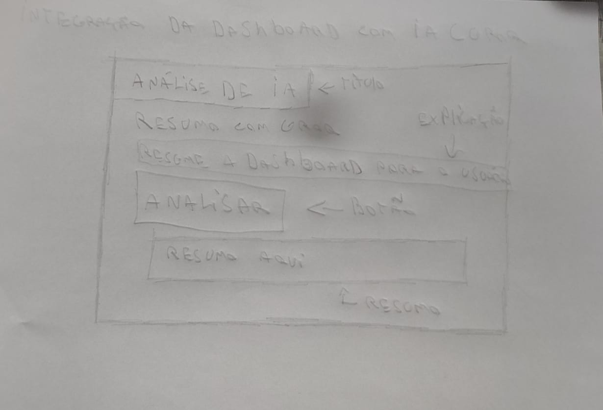

# Documentação Individual — Lucas Delmiro

## Componente desenvolvido

**Card de Análise de IA** — Um componente de dashboard que transforma os dados
do projeto em um resumo executivo em linguagem natural, gerado pelo Groq.
O card identifica automaticamente riscos como tarefas atrasadas, membros
sobrecarregados e gargalos de execução, eliminando a necessidade de interpretar
gráficos manualmente.

---

## Wireframe

Desenhei o wireframe à mão antes de partir para o código. A estrutura definida foi:

- Título "Análise de IA" no topo
- Subtítulo identificando o modelo utilizado (Groq)
- Descrição curta explicando o que o componente faz
- Chips indicando quais dados são utilizados na análise
- Botão "Analisar projeto"
- Área de output onde o resumo gerado aparece

---

## Processo de desenvolvimento

Com o wireframe definido, escrevi o HTML e CSS do componente isolado.
A ideia era fazer algo que funcionasse visualmente de forma independente
e que pudesse ser integrado ao dashboard do grupo depois.

Usei o Gemini para tirar dúvidas pontuais durante o desenvolvimento e
para entender como estruturar a chamada para a API do Groq, já que tinha
experiência prévia com a API do Gemini em outro projeto.

---

## Relação com a entrega em grupo

Este componente é a base do módulo de IA do projeto do grupo. Na integração,
ele recebe os dados reais da API da Inteli Jr (tarefas, progresso, membros)
e os envia para o Groq, que retorna o resumo exibido no card.
A lógica de integração ficou separada nos arquivos `ai.js` e `dashboard.js`.

---

## Ferramentas de IA utilizadas

| Ferramenta | Como foi utilizada |
|---|---|
| Gemini | Tirei dúvidas sobre estrutura do fetch para o Groq e ajustes de CSS |
| Groq (llama-3.1-8b-instant) | Modelo de linguagem utilizado para gerar o resumo executivo |

---

## Decisões técnicas

- **HTML e CSS puros** — O componente individual foi feito sem framework
  para manter simplicidade na entrega isolada.
- **Tailwind CSS (via CDN)** — Utilizado na entrega em grupo no `dashboard.html`,
  escolhido pela agilidade no desenvolvimento sem necessidade de build.
- **Fragment Mono** — Fonte escolhida para manter consistência visual
  com o restante do projeto do grupo.
- **Gradiente vermelho escuro** — Segue a identidade visual da Inteli Jr
  e do projeto do grupo.
- **Arquivos separados (api.js, ai.js, dashboard.js)** — A lógica foi dividida
  em arquivos com responsabilidades distintas para evitar código espaguete
  e facilitar a manutenção.

---

## Dependências do componente

Para funcionar na entrega em grupo, o card depende de:

- Dados do `GET /tasks` e `GET /projects/{id}` da API da Inteli Jr
- Uma chave válida da API do Groq configurada no `config-local.js`
- Os arquivos `api.js` e `ai.js` que fazem a ponte entre o dashboard e o Groq