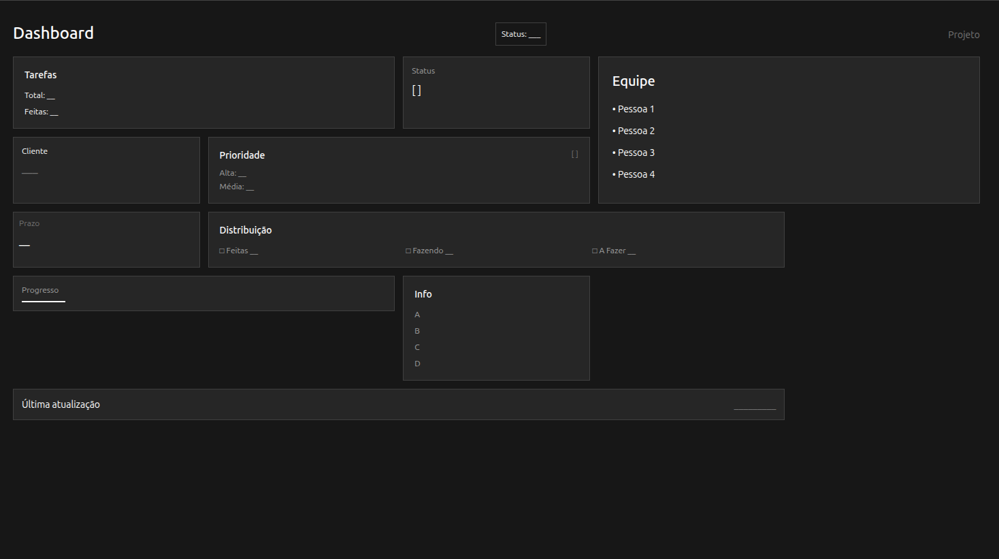
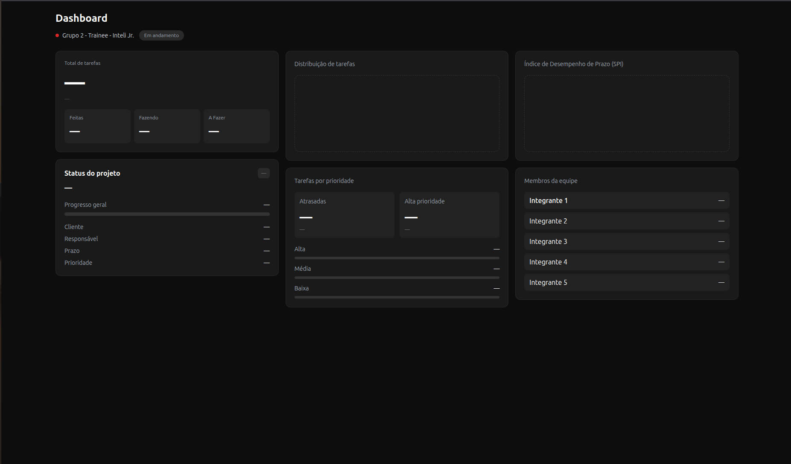

# Documentação Individual

## Componente desenvolvido
Dashboard de acompanhamento de projetos — permite visualizar o progresso geral do projeto, a distribuição de tarefas por status e prioridade, o índice de desempenho de prazo (SPI) e os membros da equipe.

---

## Wireframe

Elaborei um wireframe inicial no Figma para estruturar o layout do dashboard antes de partir para o código:

O wireframe inicial mostra um dashboard escuro com:
- cabeçalho com o título "Dashboard", um indicador de status geral e a identificação do projeto;
- painel de tarefas com total e tarefas concluídas;
- bloco de status com espaço para indicadores visuais e progressão;
- caixas de Cliente, Prioridade e Prazo;
- área de distribuição de tarefas com métricas de Feitas, Fazendo e A Fazer;
- painel de Equipe com lista de membros;
- indicador de progresso e bloco de informações adicionais;
- barra de "Última atualização" na base.

Durante o processo, percebi que esse wireframe não traduzia tão bem a experiência que eu queria passar — o visual ficou confuso e a distribuição dos cards não estava clara o suficiente. Em paralelo, o Vitor havia desenvolvido um wireframe com uma abordagem mais limpa e bem resolvida, então o grupo decidiu em conjunto adotar a referência dele como base para a entrega em grupo. O wireframe acima é de minha autoria; a adoção do do Vitor foi uma decisão coletiva tomada ao longo do processo.

A versão atual é o compenente que desenvolvi já implementado em `dashboard.html`, seguindo a versão melhorada do Vitor (feita no Figma) e mantendo a estrutura de dashboard com `Tailwind CSS` e espaço para `ApexCharts` nos gráficos, com cards de tarefas, status, SPI e equipe.

A versão implementada mantém o tema escuro e organiza os cards em um grid de três colunas, com os seguintes componentes:
- cabeçalho com o título "Dashboard", identificação do projeto (Grupo 2 – Trainee – Inteli Jr.) e badge de status "Em andamento";
- card de Total de tarefas com subcards para Feitas, Fazendo e A Fazer, cada um com seu contador;
- card de Distribuição de tarefas com área reservada para gráfico (ApexCharts);
- card de Índice de Desempenho de Prazo (SPI) com área reservada para gráfico;
- card de Status do projeto com barra de Progresso geral e campos de Cliente, Responsável, Prazo e Prioridade;
- card de Tarefas por prioridade com destaques para Atrasadas e Alta prioridade, além de barras de progresso para Alta, Média e Baixa;
- card de Membros da equipe com lista de cinco integrantes.

---

## Processo de desenvolvimento

Com o wireframe do Vitor como referência, comecei a transformar essa estrutura em código HTML. A ideia era já construir o componente individual de forma que ele pudesse ser diretamente aproveitado na entrega em grupo.

Durante o desenvolvimento, usei o Claude pontualmente como apoio técnico: para entender quais bibliotecas fariam mais sentido para o tipo de interface proposta, chegando ao Tailwind CSS pela praticidade e ao ApexCharts para os gráficos. Também usei para tirar dúvidas enquanto montava os cards, como ajustar espaçamentos, entender classes do Tailwind e organizar o grid de três colunas.

A estrutura e as decisões de layout já tinham uma base definida antes — a IA funcionou mais como suporte técnico do que como guia criativo.

---

## Relação com a entrega em grupo

O componente desenvolvido aqui serviu como base para a segunda tela do projeto. O arquivo `index.html` está estruturado com espaços reservados para integração com a API, comentários indicando cada seção e as bibliotecas, de modo que essa base possa ser aproveitada no fluxo coletivo do projeto.

---

## Ferramentas de IA utilizadas

- **Claude (Anthropic)** — suporte técnico para dúvidas sobre Tailwind, escolha de bibliotecas e ajustes de estrutura HTML.

---

## Decisões técnicas

- **Tailwind CSS via CDN** — escolhido pela agilidade no desenvolvimento, sem necessidade de instalação ou build;
- **ApexCharts via CDN** — escolhido pela facilidade de integração com JavaScript puro e boa compatibilidade com tema escuro;
- **arquivo único `index.html`** — para simplicidade na entrega individual, com espaços reservados para futura integração com a API.

---

## Dependências do componente

Para funcionar de forma completa na entrega em grupo, o componente depende de:
- dados da API: total de tarefas, distribuição por status, prioridades, SPI e lista de membros;
- integração via `fetch()` nos pontos marcados com `—` no HTML.