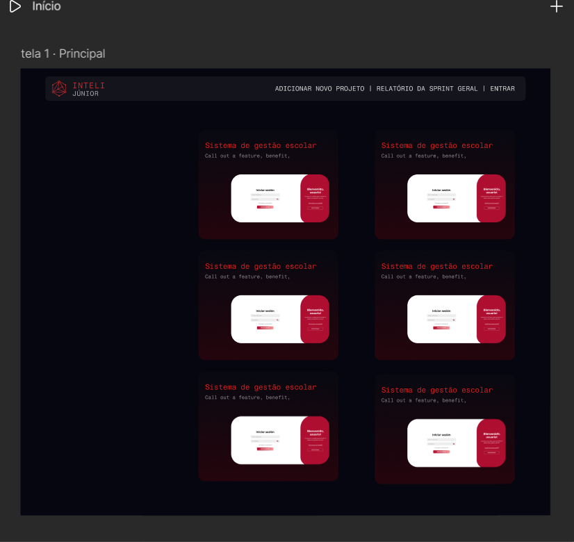
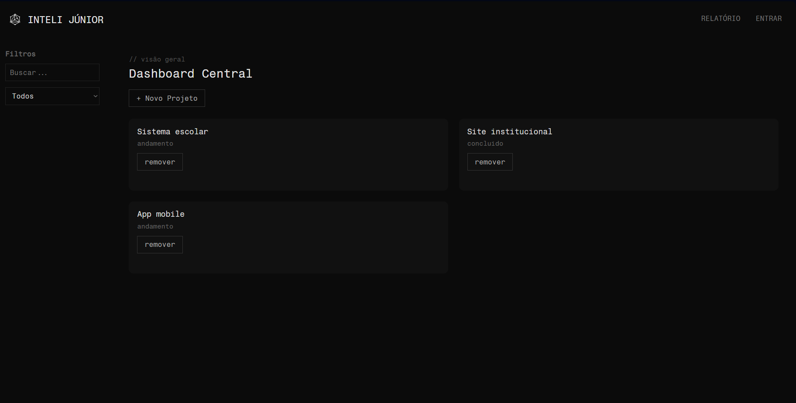
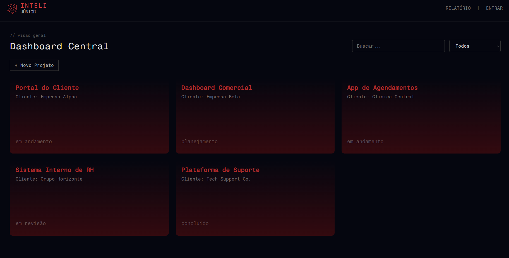
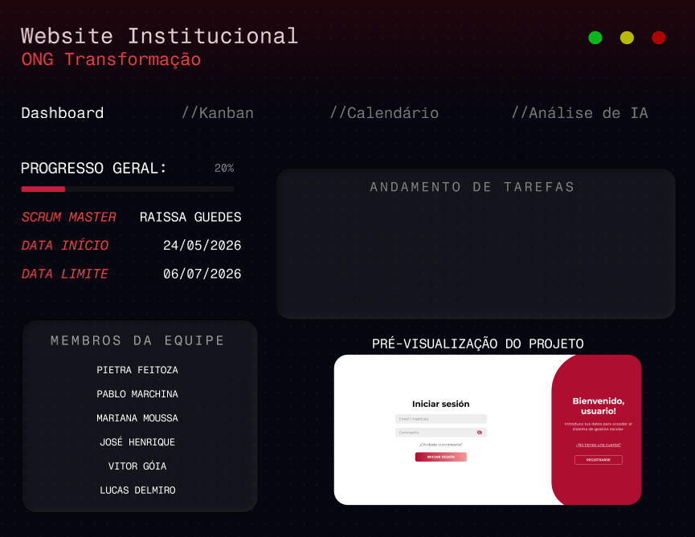

# Documentação Individual

## Introdução

Essa documentação consta com duas seções: uma da entrega individual ligada ao grupo e outra separada, onde quis reinventar e criar uma outra forma da tela inicial. Fiz dessa forma, pois apesar de ter construído elementos que poderiam constar como a entrega individual, decidi ir além e utilizar dessa oportunidade para aprimorar meus conhecimentos.

## Entrega ligada ao grupo

## Wireframe

O concept da tela que estruturei via Figma, serviu como o guia principal para construirmos a interface inicial da Vitrine de Projetos na prática.

  

O wireframe, com uma abordagem mais limpa e direta, foi pensado para ser totalmente condizente com a identidade visual já consolidada da Inteli Júnior. Seguindo a filosofia do "menos é mais", para que a interface fosse livre de poluição visual, priorizando a legibilidade das informações e a experiência do usuário na hora de acompanhar as atividades.

---

## Processo de desenvolvimento

O processo de desenvolvimento ocorreu de forma iterativa. Após o Pablo implementar o "esqueleto" inicial da aplicação, notei que a ordenação visual e o header precisavam de ajustes para refletir a verdadeira identidade da IJ. Atuei diretamente no refinamento de front-end dessa etapa, reorganizei a disposição dos elementos na tela principal e criei o header da segunda tela (que ainda não existia).

  

 

---

## Entrega Individual “extra”

Como percebi que talvez fosse necessário “ir além” e para ter um aprendizado mais denso, decidi criar um wireframe no FIGMA para a segunda tela.

 

Em relação às funcionalidades deste componente, destacam-se a visualização do progresso geral do projeto e a exibição de suas datas de início e término, cujos dados são alimentados de forma dinâmica via API. Além disso, o componente conta com uma funcionalidade de preview, estruturada para ser implementada futuramente por meio de um link de redirecionamento direto para o repositório do projeto ou mesmo imagem que poderia ser atualizada a cada Sprint pelo Product Owner. Há funcionalidades não exploradas, mas que aparecem nessa tela criada como o Kanban, Análise de IA (cuja ativação em código dependeria da configuração de uma chave de API válida), e Calendário. 

Por não estar familiarizada com criação de interfaces, foi um processo longo de aprendizado ao tentar recriar essa tela. Embora não esteja completa, tentei reproduzir parte do conceito da tela utilizando HTML e CSS, que está disponível para visualização no arquivo `index.html` e `style.css`!

