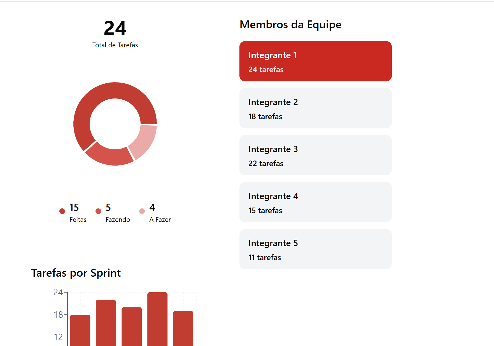
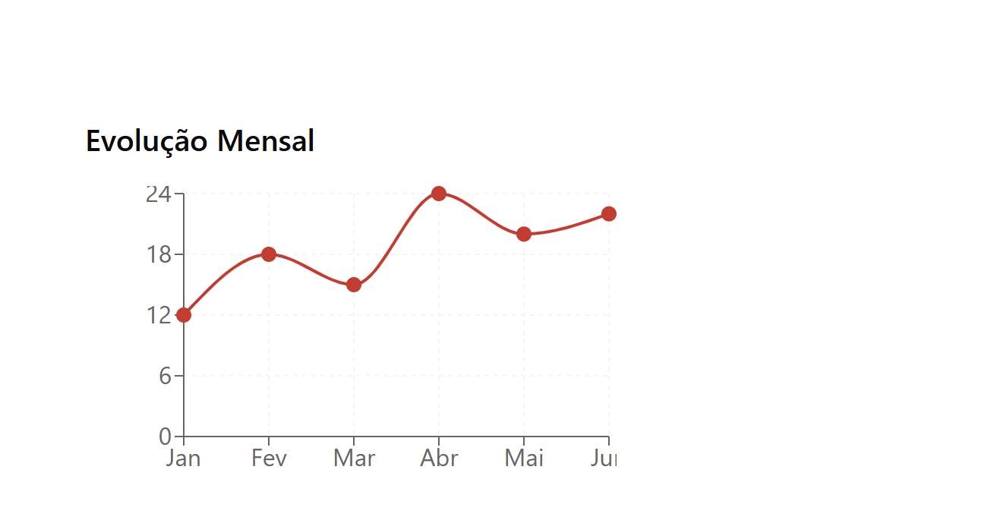
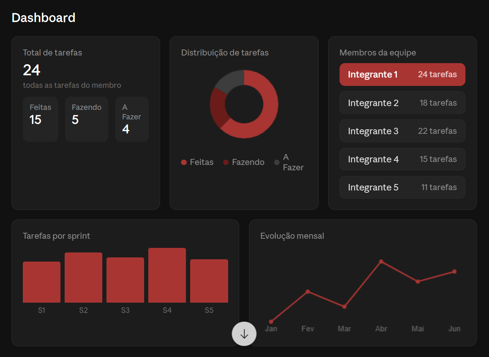
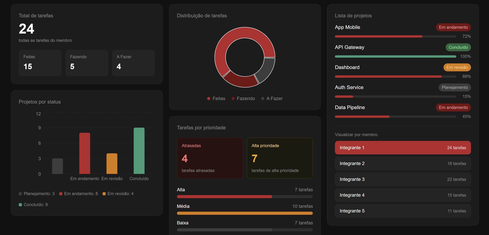
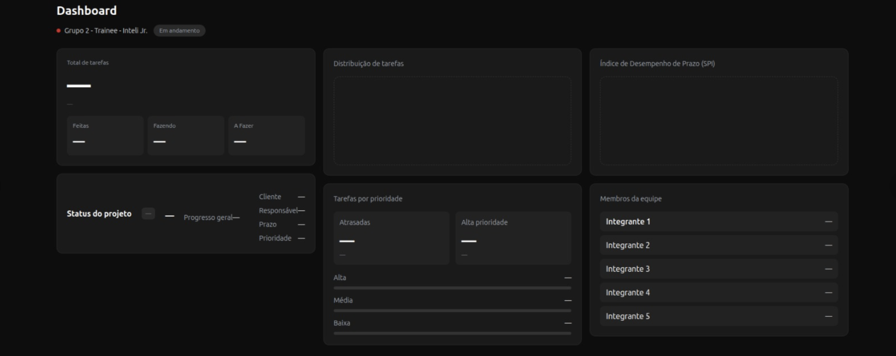
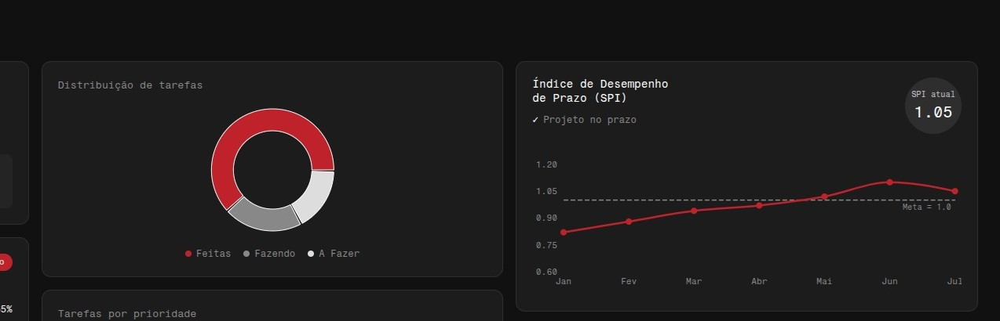
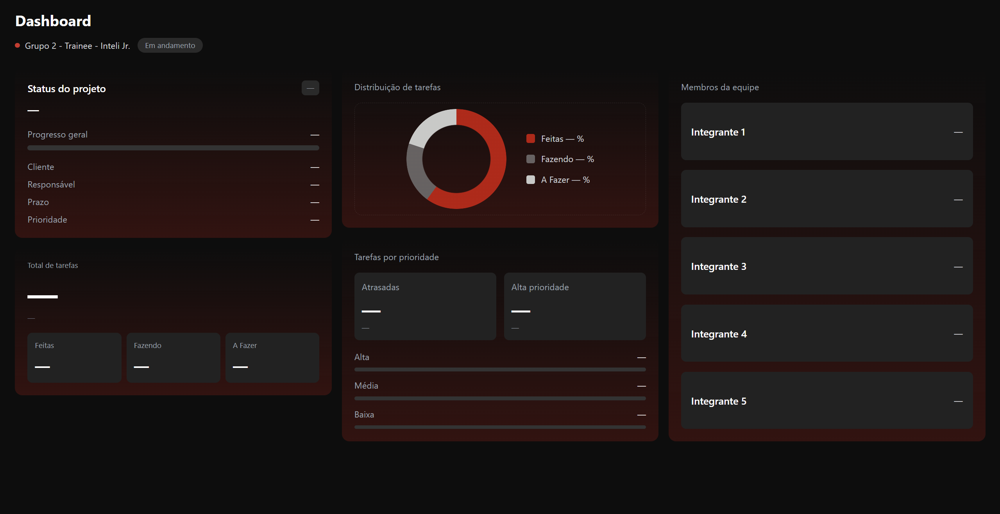

# Documentação Individual

## Componente desenvolvido/idealizado
Dashboard de acompanhamento de projetos — visão geral de tarefas, status, prioridades, membros da equipe e distribuição de tarefas.

---

## Wireframe
Elaborei um wireframe inicial no Figma, para estruturar o layout do dashboard antes de partir para o código:

Durante o processo, busquei desenvolver um wireframe com uma abordagem minimalista e que acompanhasse os interesses do grupo e da Inteli Júnior. O desenvolvimento foi sempre guiado por feedbacks da equipe para adotarmos um layout em comum, tanto para a tela 1 quanto para a tela 2 (o dashboard). Na entrega em grupo, fiquei responsável majoritariamente pelo design desta última, além de atuar em parte da programação.

---

## Processo de desenvolvimento

Comecei pelo estudo da área de gestão de projetos, para que eu tivesse uma base de componentes para o dashboard. Dessa forma, descobri diversos novos conceitos, como SPI (*Schedule Performance Index*) e CPI (*Cost Performance Index*), que acabaram não sendo integrados no projeto final devido à incompatibilidade dos dados disponíveis na API. 

Posteriormente, comecei a estudar os tipos de dados que tínhamos à disposição. A partir disso, montei uma estrutura na plataforma Figma para materializar o que estava apenas na imaginação, incluindo gráficos, tabelas, dados e o status do projeto. 

Já na parte de programação, fiquei responsável por pequenos ajustes no que a Mariana já havia desenvolvido: apliquei o gradiente de cores, retirei o gráfico de SPI, ajustei o tamanho da seção "Membros da equipe", substituí o local de "Total de Tarefas" pelo de "Status do projeto" e desenvolvi o gráfico de Distribuição de Tarefas. A ideia era construir e idealizar o componente individual de forma que ele pudesse ser diretamente aproveitado na entrega em grupo.

Durante o desenvolvimento, usei a Inteligência Artificial Claude pontualmente como apoio técnico. Como a estrutura e as decisões de layout (os gráficos e componentes à disposição no dashboard) já tinham uma base definida por mim, a IA funcionou mais como suporte para materializar as minhas ideias na plataforma. Já para a parte de código, utilizei a IA para tirar dúvidas sobre o Tailwind e auxiliar na estruturação do HTML.

---

## Relação com a entrega em grupo

Primeiramente, desenvolvi o meu wireframe no figma e disponibizei para os responsáveis em programação aplicarem no Visual Studio Code. Em seguida, utilizando a mesma base de programação da Mariana (responsável por programar a base do meu wireframe, para a entrega em grupo), continuei o desenvolvimento da tela do dashboard e fiz pequenos ajustes na parte já implementada, de modo que o componente desenvolvido aqui é a base direta do que o grupo irá utilizar. O arquivo `index.html` já está estruturado com os espaços reservados para a integração com a API, comentários indicando cada seção e as importações das bibliotecas. A ideia é que a entrega em grupo parta exatamente deste código, adicionando as demais telas, a navegação e o consumo real dos dados. Ao final, atualizei a tela do dashboard, retirando as "Tarefas por Prioridade" e colocando um kanban funcional, com "A Fazer", "Fazendo", "Feito" e "Em Revisão", para que o usuário possa ver o nome de suas tarefas e mudá-las de posição.Conectei os dados da API com a parte de "Em Revisão", uma vez que tal bloco foi adicionado posteriormente à aplicação da API ao Kanban, feito pelo Pablo, utilizando a mesma lógica do meu colega para essa nova funcionalidade. Para a entrega final, também fiquei responsável por revisar todas as funcionalidades das nossas telas e a conexão da tela com as informações da API e, assim, tive que reestruturar a conexão entre o dashboard e a IA Groq, que não estava funcionando perfeitamente.

---

## Ferramentas de IA utilizadas
- **Claude (Anthropic)** — usada como suporte técnico para dúvidas sobre o Tailwind (lógica que a Mariana estava utilizando e à qual tive que me adaptar), escolha de bibliotecas, ajustes de estrutura HTML e design na plataforma Figma.

---

## Decisões técnicas
- **Status do Projeto** — escolhido pela agilidade em identificar o projeto e suas informações principais.
- **Total de Tarefas** — escolhido para facilitar a compreensão do volume de tarefas de cada integrante.
- **Distribuição de Tarefas** — escolhido para demonstrar as tarefas de cada integrante em porcentagem, de forma visual, através de um gráfico.
- **Tarefas por prioridade** — escolhido para proporcionar um melhor entendimento sobre a prioridade e a pontualidade das entregas de cada integrante.
- **Membros da Equipe** — escolhido para, em uma mesma tela, concentrar e exibir os diferentes status das tarefas de cada integrante do projeto.

---

## Dependências do componente
Para funcionar de forma completa na entrega em grupo, o componente depende de:
- Dados da API: total de tarefas, distribuição por status, prioridades, SPI e lista de membros.
- Integração via `fetch()` nos pontos marcados com `—` no HTML.

---

## Processo criativo do dashboard

Abaixo, detalho melhor como foi o processo para chegar à tela do dashboard atual:

As duas primeiras composições representam as minhas interpretações iniciais de como seria o dashboard, antes mesmo de compreender os dados que seriam fornecidos pela API.

Figura 1: Concept Art - Dashboard Inicial (Versão 1)  
 
Fonte: Material produzido pelo autor (2026)  

Figura 2: Concept Art - Dashboard Inicial (Versão 2)  
 
Fonte: Material produzido pelo autor (2026)  

A composição seguinte representa uma evolução da primeira ideia, com uma adequação à paleta de cores da Inteli Júnior, mudança realizada com base nos feedbacks do grupo.

Figura 3: Concept Art - Adequação à paleta de cores  
 
Fonte: Material produzido pelo autor (2026)  

A terceira composição mostra a tela já ajustada com base nos dados fornecidos na API (antes de conhecermos a estrutura da tela 1), de forma que a lista de todos os projetos estivesse concentrada em um único dashboard.

Figura 4: Concept Art - Integração com dados da API  
 
Fonte: Material produzido pelo autor (2026)  

As composições seguintes representam o final da ideação no Figma, etapa na qual o processo de adequação à paleta e aos interesses do grupo foi finalizado. O código desta tela foi iniciado pela Mariana no Visual Studio Code e o design projetado por mim no Figma.

Figura 5: Concept Art - Ideação final no Figma (Versão 1)  
 
Fonte: Material produzido pelo autor (2026)  

Figura 6: Concept Art - Ideação final no Figma (Versão 2)  
 
Fonte: Material produzido pelo autor (2026)  

A última composição representa o resultado dos pequenos ajustes programados por mim na tela feita pela Mariana no Visual Studio Code, trazendo elementos compatíveis com a primeira tela, com os interesses do grupo, com a paleta de cores e com os dados da API.

Figura 7: Resultado Final - Dashboard Programado  
 
Fonte: Material produzido pelo autor (2026)  

